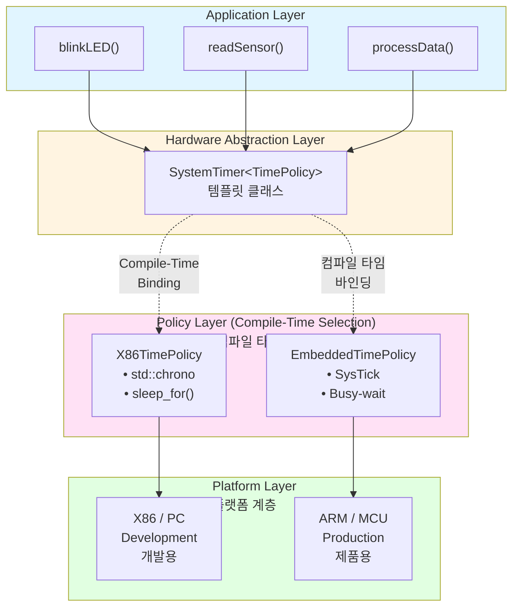
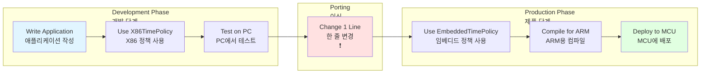
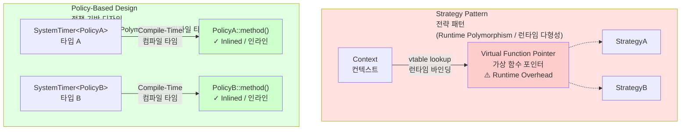
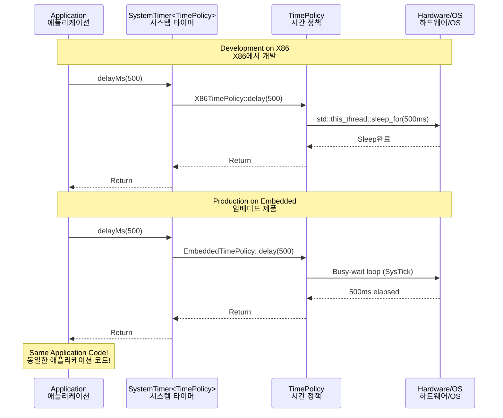

# Policy-Based Design in Modern C++

This example demonstrates the Policy-Based Design pattern implemented in modern C++. Policy-Based Design uses templates to enable compile-time polymorphism, allowing you to write platform-independent code that can be easily ported between different environments (e.g., X86 development and embedded production) with minimal code changes.

이 예제는 modern C++로 구현된 Policy-Based Design pattern을 보여줍니다. Policy-Based Design은 template을 사용하여 컴파일 타임 다형성을 가능하게 하며, 서로 다른 환경(예: X86 개발 환경과 임베디드 제품 환경) 간에 최소한의 코드 변경으로 쉽게 이식할 수 있는 플랫폼 독립적인 코드를 작성할 수 있게 합니다.

## Architecture Overview

**아키텍처 개요**



## Cross-Platform Development Flow

**크로스 플랫폼 개발 흐름**



## Policy-Based Design vs Strategy Pattern

**정책 기반 디자인 vs 전략 패턴 비교**



## Real-World Use Case: Time System

**실제 사용 사례: 타이밍 시스템**



## Files

- **ex85.cpp**: This file contains the C++ code that demonstrates Policy-Based Design using a cross-platform timing system with X86 and Embedded policies.
- **Makefile**: This file is used to compile the C++ code. It contains instructions for building the executable using `g++`.

## How to use

The example code demonstrates a Policy-Based Design implementation for a timing system:

```cpp
#include <iostream>
#include <chrono>
#include <thread>

// X86 Platform Time Policy
// X86 플랫폼 시간 정책
struct X86TimePolicy {
    static void init() {
        // Uses std::chrono (C++ standard library)
        // std::chrono 사용 (C++ 표준 라이브러리)
    }

    static uint32_t getMilliseconds() {
        auto now = std::chrono::steady_clock::now();
        return duration_cast<milliseconds>(now.time_since_epoch()).count();
    }

    static void delay(uint32_t ms) {
        std::this_thread::sleep_for(std::chrono::milliseconds(ms));
    }
};

// Embedded Platform Time Policy
// 임베디드 플랫폼 시간 정책
struct EmbeddedTimePolicy {
    static uint32_t systick_counter;  // Hardware timer

    static void init() {
        // Initialize SysTick timer (ARM Cortex-M)
        // SysTick 타이머 초기화 (ARM Cortex-M)
        SysTick_Config(SystemCoreClock / 1000);
    }

    static uint32_t getMilliseconds() {
        return systick_counter;  // Read hardware register
    }

    static void delay(uint32_t ms) {
        uint32_t start = getMilliseconds();
        while (getMilliseconds() - start < ms);  // Busy-wait
    }
};

// Platform-independent timer class
// 플랫폼 독립적인 타이머 클래스
template<typename TimePolicy>
class SystemTimer {
public:
    static void initialize() {
        TimePolicy::init();
    }

    static uint32_t millis() {
        return TimePolicy::getMilliseconds();
    }

    static void delayMs(uint32_t ms) {
        TimePolicy::delay(ms);
    }
};

// Application code - COMPLETELY PLATFORM INDEPENDENT!
// 애플리케이션 코드 - 완전히 플랫폼 독립적!
template<typename TimePolicy>
void blinkLED() {
    led.on();
    SystemTimer<TimePolicy>::delayMs(500);
    led.off();
    SystemTimer<TimePolicy>::delayMs(500);
}

// In main.cpp - ONLY PLACE TO CHANGE FOR PORTING
// main.cpp에서 - 이식을 위해 변경하는 유일한 곳
#ifdef X86_PLATFORM
    using PlatformTimer = SystemTimer<X86TimePolicy>;
#else
    using PlatformTimer = SystemTimer<EmbeddedTimePolicy>;
#endif

int main() {
    PlatformTimer::initialize();

    // Application logic - NO CHANGES NEEDED!
    // 애플리케이션 로직 - 변경 불필요!
    while(1) {
        blinkLED<...>();
        readSensors();
    }
}
```

This code shows:
1. Platform-specific policies (X86TimePolicy and EmbeddedTimePolicy)
2. Policy classes with static methods (compile-time binding)
3. Template-based host class (SystemTimer)
4. Completely platform-independent application code
5. Only one line change needed for porting (typedef/using declaration)

이 코드는 다음을 보여줍니다:
1. 플랫폼별 정책들 (X86TimePolicy와 EmbeddedTimePolicy)
2. 정적 메서드를 가진 정책 클래스들 (컴파일 타임 바인딩)
3. 템플릿 기반 호스트 클래스 (SystemTimer)
4. 완전히 플랫폼 독립적인 애플리케이션 코드
5. 이식을 위해 단 한 줄만 변경 필요 (typedef/using 선언)

**컴파일 및 실행 방법**

1. **Compile the Code**: Open a terminal and navigate to the `ex85-policy-based-pattern` directory. Run the following command to compile the code:

   **코드 컴파일**: terminal을 열고 `ex85-policy-based-pattern` 디렉토리로 이동합니다. 다음 명령어를 실행하여 코드를 컴파일합니다:
   ```bash
   make
   ```

2. **Run the Executable**: After compiling, run the executable with the following command:

   **실행 파일 실행**: 컴파일 후, 다음 명령어로 실행 파일을 실행합니다:
   ```bash
   ./ex85.out
   ```

3. **Clean Up**: To remove the compiled executable, use the following command:

   **정리**: 컴파일된 실행 파일을 제거하려면 다음 명령어를 사용합니다:
   ```bash
   make clean
   ```

## Test

To test this example, you can follow these steps:

```bash
git clone https://github.com/makepluscode/modern-cpp-examples.git
cd ex85-policy-based-pattern
make
./ex85.out
```

This will compile the example and create an executable named `ex85.out`. When you run it, you'll see the output showing:
- X86 platform using std::chrono for timing
- Embedded platform using SysTick simulation
- Same application logic working on both platforms
- LED blinking, sensor reading, and performance measurement
- Platform-specific implementation details

## What You Will Learn

**배울 내용**

- How to implement Policy-Based Design in modern C++
- How to use templates for compile-time polymorphism
- How to create cross-platform code for X86 and embedded systems
- How to abstract platform-specific details using policies
- The difference between Strategy pattern and Policy-Based Design
- Zero-cost abstraction techniques for embedded systems
- Practical techniques for porting code between platforms
- Real-world hardware abstraction layer (HAL) design

- Modern C++에서 Policy-Based Design을 구현하는 방법
- 컴파일 타임 다형성을 위한 템플릿 사용법
- X86과 임베디드 시스템을 위한 크로스 플랫폼 코드 작성법
- 정책을 사용하여 플랫폼별 세부사항을 추상화하는 방법
- Strategy pattern과 Policy-Based Design의 차이점
- Embedded system을 위한 제로 비용 추상화 기법
- 플랫폼 간 코드 이식을 위한 실용적인 기법
- 실제 하드웨어 추상화 계층 (HAL) 설계

## Key Advantages

**주요 장점**

Policy-Based Design provides several benefits for cross-platform development:
- Write once, compile for multiple platforms
- Zero runtime overhead - all calls are inlined by the compiler
- Platform-independent application code
- Easy porting - change only policy selection
- Type-safe compile-time checks
- No virtual function overhead (no vtable)
- Ideal for resource-constrained embedded systems
- Same code can be debugged on X86 and deployed to embedded

Policy-Based Design은 크로스 플랫폼 개발에 여러 이점을 제공합니다:
- 한 번 작성하고 여러 플랫폼용으로 컴파일
- 제로 런타임 오버헤드 - 컴파일러가 모든 호출을 인라인화
- 플랫폼 독립적인 애플리케이션 코드
- 쉬운 이식 - 정책 선택만 변경
- 타입 안전한 컴파일 타임 검사
- 가상 함수 오버헤드 없음 (vtable 없음)
- 리소스가 제한된 embedded system에 이상적
- 같은 코드를 X86에서 디버깅하고 임베디드에 배포 가능

## Performance Characteristics

**성능 특성**

Unlike Strategy pattern, Policy-Based Design has:
- No heap allocations (no `new`/`delete`)
- No virtual function call overhead
- Smaller code size in many cases
- Better cache locality
- All policy decisions made at compile-time
- Enables aggressive compiler optimizations

Strategy pattern과 달리, Policy-Based Design은:
- Heap 할당 없음 (`new`/`delete` 없음)
- 가상 함수 호출 오버헤드 없음
- 많은 경우 더 작은 코드 크기
- 더 나은 cache locality
- 모든 정책 결정이 컴파일 타임에 이루어짐
- 공격적인 컴파일러 최적화 가능
